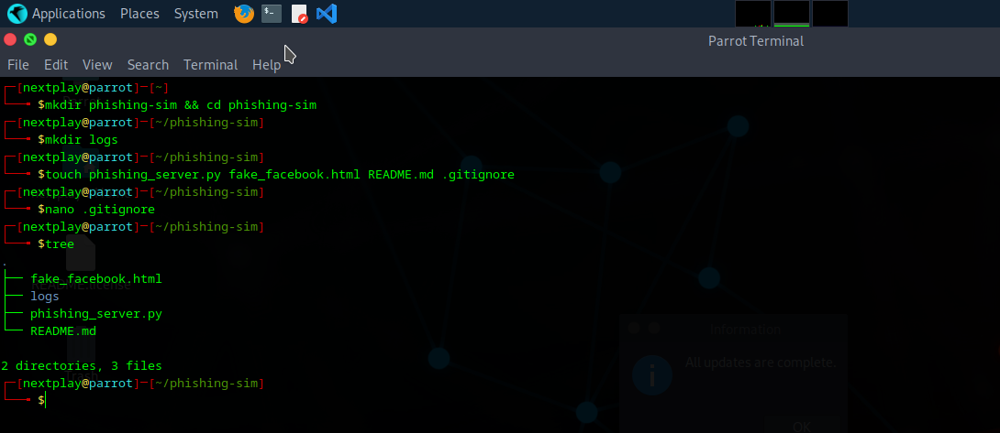
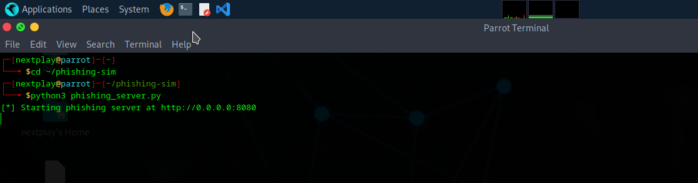
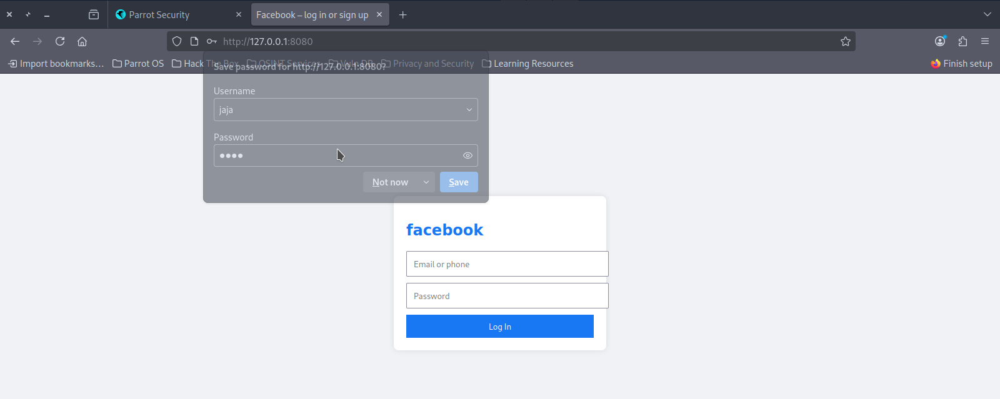
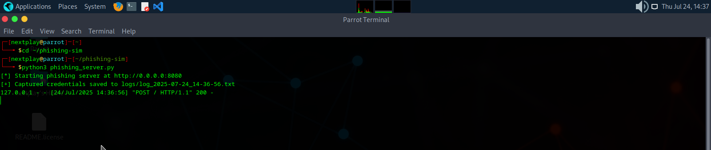
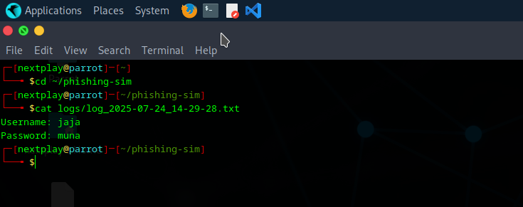

# 🎯 Phishing Simulation Tool

A basic phishing simulation script built for educational and ethical awareness purposes. It serves a fake login page, logs credentials entered, and saves them for review.

---

## 🚀 Getting Started

```bash
git clone https://github.com/nextplay-box/phishing-sim.git
cd phishing-sim
python3 phishing_sim.py
```

---

## 📁 Project Structure

```
phishing-sim/
│
├── phishing_sim.py            # Main server script
├── templates/
│   └── index.html             # Phishing login page
├── logs/
│   └── log_YYYY-MM-DD.txt     # Saved credentials
├── screenshot/
│   ├── s1.png
│   ├── s2.png
│   ├── s3.png
│   ├── s4.png
│   └── s5.png
└── README.md
```

---

## 🖼️ Screenshots

All screenshots are located in the `screenshots/` folder.

Below are previews:








---

## 🧠 Disclaimer

This tool is built **only for ethical testing and awareness**.

> ⚠️ **Do not deploy** this tool against users or systems you **do not have explicit permission** to test.

The author is **not responsible** for any misuse of this tool. Use responsibly and within legal boundaries.

---

## 📢 Author

Created by **Augustine Anapuwa Oputa**  
GitHub: [nextplay-box](https://github.com/nextplay-box)

Feel free to fork, contribute, or suggest improvements!

